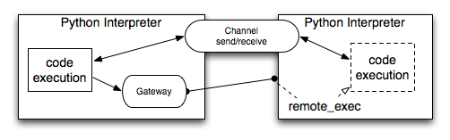

==============================================================================
API in a nutshell
==============================================================================

execnet ad-hoc instantiates local and remote Python interpreters.
Each interpreter is accessible through a **Gateway** which manages
code and data communication.  **Channels** allow to exchange
data between the local and the remote end.  **Groups**
help to manage creation and termination of sub-interpreters.

.. currentmodule:: execnet

Gateways: bootstrapping Python interpreters
===================================================

All Gateways are instantiated via a call to ``makegateway()``
passing it a gateway specification or URL.

.. _xspec:

.. autofunction:: execnet.makegateway(spec)

Here is an example which instantiates a simple Python subprocess::

    >>> gateway = execnet.makegateway()

Gateways allow to `remote execute code`_ and
`exchange data`_ bidirectionally.

Examples for valid gateway specifications
-------------------------------------------

* ``ssh=wyvern//python=python3.3//chdir=mycache`` specifies a Python3.3
  interpreter on the host ``wyvern``.  The remote process will have
  ``mycache`` as its current working directory.

* ``ssh=-p 5000 myhost`` makes execnet pass "-p 5000 myhost" arguments
  to the underlying ssh client binary, effectively specifying a custom port.

* ``vagrant_ssh=default`` makes execnet connect to a Vagrant VM named
  ``default`` via SSH through Vagrant's ``vagrant ssh`` command. It supports
  the same additional parameters as regular SSH connections.

* ``popen//python=python2.7//nice=20`` specification of
  a python subprocess using the ``python2.7`` executable which must be
  discoverable through the system ``PATH``; running with the lowest
  CPU priority ("nice" level).  By default current dir will be the
  current dir of the instantiator.

* ``popen//dont_write_bytecode`` uses the same executable as the current
  Python, and also passes the ``-B`` flag on startup, which tells Python not
  write ``.pyc`` or ``.pyo`` files.

* ``popen//env:NAME=value`` specifies a subprocess that uses the
  same interpreter as the one it is initiated from and additionally
  remotely sets an environment variable ``NAME`` to ``value``.

* ``popen//execmodel=eventlet`` specifies a subprocess that uses the
  same interpreter as the one it is initiated from but will run the
  other side using eventlet for handling IO and dispatching threads.

* ``socket=192.168.1.4:8888`` specifies a Python Socket server
  process that listens on ``192.168.1.4:8888``

.. versionadded:: 1.5

* ``vagarant_ssh`` opens a python interpreter via the vagarant ssh command

.. _`remote execute code`:

remote_exec: execute source code remotely
===================================================

.. currentmodule:: execnet.gateway

All gateways offer a simple method to execute source code
in the instantiated subprocess-interpreter:

.. automethod:: Gateway.remote_exec(source)

It is allowed to pass a module object as source code
in which case its source code will be obtained and
get sent for remote execution.  ``remote_exec`` returns
a channel object whose symmetric counterpart channel
is available to the remotely executing source.

.. method:: Gateway.reconfigure([py2str_as_py3str=True, py3str_as_py2str=False])

    Reconfigures the string-coercion behaviour of the gateway

.. _`Channel`:
.. _`channel-api`:

.. _`exchange data`:

Channels: exchanging data with remote code
=======================================================

.. currentmodule:: execnet.gateway_base

A channel object allows to send and receive data between
two asynchronously running programs.

   .. automethod:: Channel.send(item)
   .. automethod:: Channel.receive(timeout)
   .. automethod:: Channel.setcallback(callback, endmarker=_NOENDMARKER)
   .. automethod:: Channel.makefile(mode, proxyclose=False)
   .. automethod:: Channel.close(error)
   .. automethod:: Channel.waitclose(timeout)
   .. autoattribute:: Channel.RemoteError
   .. autoattribute:: Channel.TimeoutError

.. _Group:

Grouped Gateways and robust termination
===============================================

.. currentmodule:: execnet.multi

All created gateway instances are part of a group.  If you
call ``execnet.makegateway`` it actually is forwarded to
the ``execnet.default_group``. Group objects are container
objects (see :doc:`group examples <example/test_group>`)
and manage the final termination procedure:

.. automethod:: Group.terminate(timeout=None)

This method is implicitly called for each gateway group at
process-exit, using a small timeout.  This is fine
for interactive sessions or random scripts which
you rather like to error out than hang.  If you start many
processes then you often want to call ``group.terminate()``
yourself and specify a larger or not timeout.

threading models: gevent, eventlet, thread, main_thread_only
====================================================================

.. versionadded:: 1.2 (status: experimental!)

execnet supports "main_thread_only", "thread", "eventlet" and "gevent"
as thread models on each of the two sides.  You need to decide which
model to use before you create any gateways::

    # content of threadmodel.py
    import execnet
    # locally use "eventlet", remotely use "thread" model
    execnet.set_execmodel("eventlet", "thread")
    gw = execnet.makegateway()
    print (gw)
    print (gw.remote_status())
    print (gw.remote_exec("channel.send(1)").receive())

You need to have eventlet installed in your environment and then
you can execute this little test file::

    $ python threadmodel.py
    <Gateway id='gw0' receive-live, eventlet model, 0 active channels>
    <RInfo 'numchannels=0, numexecuting=0, execmodel=thread'>
    1

How to execute in the main thread
------------------------------------------------

When the remote side of a gateway uses the "thread" model, execution
will preferably run in the main thread.  This allows GUI loops
or other code to behave correctly.  If you, however, start multiple
executions concurrently, they will run in non-main threads.

remote_status: get low-level execution info
===================================================

.. currentmodule:: execnet.gateway

All gateways offer a simple method to obtain some status
information from the remote side.

.. automethod:: Gateway.remote_status(source)

Calling this method tells you e.g. how many execution
tasks are queued, how many are executing and how many
channels are active.

rsync: synchronise filesystem with remote
===============================================================

.. currentmodule:: execnet

``execnet`` implements a simple efficient rsyncing protocol.
Here is a basic example for using RSync::

    rsync = execnet.RSync('/tmp/source')
    gw = execnet.makegateway()
    rsync.add_target(gw, '/tmp/dest')
    rsync.send()

And here is API info about the RSync class.

.. autoclass:: RSync
    :members: add_target,send

Debugging execnet
===============================================================

By setting the environment variable ``EXECNET_DEBUG`` you can
configure a tracing mechanism:

:EXECNET_DEBUG=1:  write per-process trace-files to ``execnet-debug-PID``
:EXECNET_DEBUG=2:  perform tracing to stderr (popen-gateway workers will send this to their instantiator)

.. _`dumps/loads`:
.. _`dumps/loads API`:

Cross-interpreter serialization of Python objects
=======================================================

.. versionadded:: 1.1

Execnet exposes a function pair which you can safely use to
store and load values from different Python interpreters
(e.g. Python2 and Python3, PyPy and Jython). Here is
a basic example::

    >>> import execnet
    >>> dump = execnet.dumps([1,2,3])
    >>> execnet.loads(dump)
    [1,2,3]

For more examples see :ref:`dumps/loads examples`.

.. autofunction:: execnet.dumps(spec)
.. autofunction:: execnet.loads(spec)
