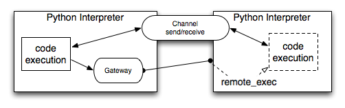

==============================================================================
API in a nutshell
==============================================================================

execnet ad-hoc instantiates local and remote Python interpreters.
Each interpreter is accessible through a **Gateway** which manages
code and data communication.  **Channels** allow to exchange
data between the local and the remote end.  **Groups**
help to manage creation and termination of sub-interpreters.

.. currentmodule:: execnet

Namespaces
===============================================

execnet has one namespace per concurrency library you drive it *from*.  All
of them speak the same protocol to the same kind of worker; what differs is
what a waiting call does to the caller.

:mod:`execnet.sync`
    The blocking API for plain threads.  The top-level ``execnet.*`` names
    are aliases into it, so ``import execnet`` is this surface.

:mod:`execnet.trio`
    ``AsyncGroup``, ``AsyncGateway``, ``AsyncChannel``, awaited inside your
    own ``trio.run``.

:mod:`execnet.aio`
    The same three classes for asyncio, awaited inside your own event loop.

:mod:`execnet.gevent`
    The blocking API again, except that every wait parks the calling
    *greenlet* rather than its OS thread.  Needs ``execnet[gevent]``.

:mod:`execnet.raw_trio`
    execnet embedded in your own trio run: the gateways are tasks in your
    nursery and there is no engine at all.  See
    :ref:`trio-or-raw-trio` for when to prefer it over
    :mod:`execnet.trio`.

:mod:`execnet.raw_trio` is the only surface that runs gateways *directly*,
as tasks in your own nursery.  The others run protocol IO on a protocol
engine (see `The protocol engine`_); the two blocking ones then block the
caller until it answers, which inside a running event loop would stall
every task on it, so those calls raise ``RuntimeError`` naming the
namespace to use instead.

::

    import trio
    import execnet.trio

    async def main():
        async with execnet.trio.AsyncGroup() as group:
            gateway = await group.makegateway("popen")
            channel = await gateway.remote_exec("channel.send(6 * 7)")
            print(await channel.receive())

    trio.run(main)

The rest of this page shows the blocking API.  Apart from ``async``/``await``
and the ``Async`` prefix, the async namespaces mirror it; see
:doc:`the namespace reference <api>` for what each one offers.

This is about the *caller*.  Where remote code runs inside the worker is an
independent choice -- see `Worker profiles`_.

Gateways: bootstrapping Python interpreters
===================================================

All Gateways are instantiated via a call to ``makegateway()``
passing it a gateway specification or URL.

.. _xspec:

.. autofunction:: execnet.makegateway(spec)

Here is an example which instantiates a simple Python subprocess::

    >>> import execnet
    >>> gateway = execnet.makegateway()

Gateways allow to `remote execute code`_ and
`exchange data`_ bidirectionally.

Workers are never sent their own source code: a worker imports the
``execnet`` (and ``trio``) that is installed in the environment it runs in.
Where that environment does not have execnet yet, it is provisioned with
uv_ -- so a bare ``python=`` interpreter or an ssh remote needs ``uv`` on
its ``PATH``, not a pre-installed execnet.

.. _uv: https://docs.astral.sh/uv/

Examples for valid gateway specifications
-------------------------------------------

* ``ssh=wyvern//python=python3.13//chdir=mycache`` specifies a Python 3.13
  interpreter on the host ``wyvern``.  The remote process will have
  ``mycache`` as its current working directory.

* ``ssh=-p 5000 myhost`` makes execnet pass "-p 5000 myhost" arguments
  to the underlying ssh client binary, effectively specifying a custom port.

* ``vagrant_ssh=default`` makes execnet connect to a Vagrant VM named
  ``default`` via SSH through Vagrant's ``vagrant ssh`` command. It supports
  the same additional parameters as regular SSH connections.

* ``popen//python=python3.13//nice=20`` specification of
  a python subprocess using the ``python3.13`` executable which must be
  discoverable through the system ``PATH``; running with the lowest
  CPU priority ("nice" level).  By default current dir will be the
  current dir of the instantiator.

* ``popen//dont_write_bytecode`` uses the same executable as the current
  Python, and also passes the ``-B`` flag on startup, which tells Python not
  write ``.pyc`` or ``.pyo`` files.

* ``popen//env:NAME=value`` specifies a subprocess that uses the
  same interpreter as the one it is initiated from and additionally
  remotely sets an environment variable ``NAME`` to ``value``.

* ``socket=192.168.1.4:8888`` specifies a Python server process that
  listens on ``192.168.1.4:8888``.  Such a server is started with the
  ``execnet server`` command, e.g. run anywhere with
  ``uvx --from execnet execnet server :8888``; see
  :ref:`instantiate gateways through sockets <socket-server>`.

.. _spec-keys:

Specification keys
-------------------------------------------

*Which interpreter to reach, and how*

``popen``
    A subprocess of this process.  The default when no other target is given.

``python=PATH``
    The interpreter to run, as a path or a ``PATH``-discoverable name.
    Combined with ``popen``, ``ssh=`` or ``vagrant_ssh=``.

``ssh=ARGS``
    Run the worker on a host reachable by the ``ssh`` client binary.  The
    value is passed to it as arguments, so ``ssh=-p 5000 myhost`` works.

``ssh_config=PATH``
    An ssh configuration file to pass as ``-F PATH``.

``vagrant_ssh=NAME``
    Like ``ssh=``, through ``vagrant ssh`` for the named box.

``socket=HOST:PORT``
    Connect to a running ``execnet server`` and have it spawn the worker.

``via=GATEWAY-ID``
    Create this gateway's connection *on* another gateway of the same group,
    which then relays for it (see :doc:`proxy examples <example/test_proxy>`).

``installvia=GATEWAY-ID``
    Start a socket server through the named gateway and connect to it.

*What the worker looks like*

``profile=thread|trio|gevent``
    Where exec'd code runs inside the worker; see `Worker profiles`_.
    ``execmodel=`` is an accepted older spelling of the same key.

``transport=socket|stdio``
    Which stream carries the protocol; see `Transports`_.

``stdin=``, ``stdout=``, ``stderr=``
    What the worker does with its standard fds; see `Worker output`_.

``id=NAME``
    The gateway's id within its group, instead of an allocated ``gwN``.

``chdir=PATH``
    Working directory of the worker.  Defaults to the instantiator's
    directory for ``popen``, and to the login home directory for ``ssh=``.

``nice=N``
    Run the worker at that ``nice`` level (POSIX).

``dont_write_bytecode``
    Pass ``-B`` to the worker interpreter.

``env:NAME=value``
    Set an environment variable in the worker.  May be repeated.

Keys are separated by ``//``, may not repeat, and a key without ``=value``
means ``True``.

.. _`remote execute code`:

remote_exec: execute source code remotely
===================================================

.. currentmodule:: execnet

All gateways offer a simple method to execute source code
in the instantiated subprocess-interpreter:

.. automethod:: Gateway.remote_exec(source)

It is allowed to pass a module object as source code
in which case its source code will be obtained and
get sent for remote execution.  ``remote_exec`` returns
a channel object whose symmetric counterpart channel
is available to the remotely executing source.

.. _`Channel`:
.. _`channel-api`:

.. _`exchange data`:

Channels: exchanging data with remote code
=======================================================

.. currentmodule:: execnet

A channel object allows to send and receive data between
two asynchronously running programs.

   .. automethod:: Channel.send(item)
   .. automethod:: Channel.receive(timeout)
   .. automethod:: Channel.setcallback(callback, endmarker=_NOENDMARKER)
   .. automethod:: Channel.makefile(mode, proxyclose=False)
   .. automethod:: Channel.close(error)
   .. automethod:: Channel.waitclose(timeout)
   .. autoattribute:: Channel.RemoteError
   .. autoattribute:: Channel.TimeoutError

.. _Group:

Grouped Gateways and robust termination
===============================================

.. currentmodule:: execnet

All created gateway instances are part of a group.  If you
call ``execnet.makegateway`` it actually is forwarded to
the ``execnet.default_group``. Group objects are container
objects (see :doc:`group examples <example/test_group>`)
and manage the final termination procedure:

.. automethod:: Group.terminate(timeout=None)

This method is implicitly called for each gateway group at
process-exit, using a small timeout.  This is fine
for interactive sessions or random scripts which
you rather like to error out than hang.  If you start many
processes then you often want to call ``group.terminate()``
yourself and specify a larger or not timeout.

.. _worker-profiles:

Worker profiles
====================================================================

.. versionchanged:: 3.0
   The ``execmodel=`` key is now spelled ``profile=`` and only ever
   described the *worker*.  The local execution model it was named after
   no longer exists: see `Namespaces`_ for the local choice.

A worker's profile says where the code you ``remote_exec`` runs relative to
the worker's own protocol loop.  Pass it per gateway::

    >>> import execnet
    >>> gw = execnet.makegateway("popen//profile=trio")

``thread`` (the default)
    Exec'd code runs on the worker's main thread while that is free, and on
    pool threads for anything concurrent with it.  The *first*
    ``remote_exec`` always gets the real main thread, which is what GUI
    loops and signal handlers need.

``trio``
    Exec'd code runs as a task on the worker's own Trio loop, in the single
    thread of that process, and is handed an ``AsyncChannel``.  Sources must
    be async -- a plain function, or a source string with no top-level
    ``await``, is rejected rather than allowed to starve the loop.

``gevent``
    Exec'd code runs as a greenlet on a gevent hub owning the worker's main
    thread, so concurrent execs cooperate on that one thread.  Provisioning
    adds the ``gevent`` requirement to the worker environment.

``main_thread_only`` is deprecated and now behaves like ``thread``, whose
main-thread claim is what it existed for.  Its other behaviour is gone: a
second concurrent ``remote_exec`` used to fail the channel with
``concurrent remote_exec would cause deadlock``, and now runs on a pool
thread.

Set the default for a whole group with ``Group(profile=...)`` or
``group.set_profile(...)``; ``execnet.set_profile(...)`` sets it on the
default group.

How many at once
-------------------------------------------------------

.. versionadded:: 3.0

Under ``thread`` each exec needs a thread of the worker's thread budget,
which also has to serve channel callbacks and the worker's own protocol
work -- so a worker admits **half that budget** in concurrent
``remote_exec`` calls (20, unless the worker changed trio's default
limiter) and *refuses* the one after that with a ``RemoteError`` naming the
limit.  ``remote_status().execcapacity`` reports the number.

Refusing rather than queueing is deliberate: a request waiting for a thread
that only a finishing exec can free is indistinguishable, from the
coordinator, from an exec that hung.  For genuine fan-out use more gateways
-- that is what a ``Group`` is for -- or a profile whose execs are not
threads.  ``trio`` and ``gevent`` are unbounded here (``execcapacity`` is
``None``): their execs are tasks and greenlets, and spend no thread.

Transports
====================================================================

.. versionadded:: 3.0

The Message protocol does not have to be the worker's stdin/stdout.  The
``transport=`` key selects:

``socket`` (the default)
    The worker gets a socket of its own for the protocol.  For ``popen`` it
    is an inherited socketpair (a socket duplicated with ``socket.share()``
    on Windows); for ``ssh=``/``vagrant_ssh=`` it is a unix socket forwarded
    with ``ssh -R`` that the worker dials back on.

``stdio``
    The classic transport: the protocol *is* the worker's stdin/stdout.

Requesting ``transport=socket`` where it cannot work is an error at
``makegateway`` time naming the platform, rather than a gateway that waits
for a worker which was never able to reach back.  That case is ssh on
Windows, where CPython does not expose ``AF_UNIX`` and Win32-OpenSSH does
not implement ``StreamLocal`` forwarding.

.. _worker-output:

Worker output
====================================================================

.. versionchanged:: 3.0
   A worker's stdio belongs to the code it runs.  It used to be redirected
   to the null device, so a remote ``print()`` went nowhere at all.

With the socket transport the worker leaves fd 0/1/2 alone: remote output
reaches your terminal (or your ``capfd``), and remote code can read *your*
stdin.  With ``transport=stdio`` the protocol needs those fds, so the worker
closes stdin and folds its stdout onto stderr instead of discarding both.

Override any of it per gateway:

===========  ==========================================  =================
key          values                                      default
===========  ==========================================  =================
``stdin=``   ``inherit``, ``close``, ``devnull``         transport-defined
``stdout=``  ``inherit``, ``devnull``, ``stderr``        transport-defined
``stderr=``  ``inherit``, ``devnull``                    transport-defined
===========  ==========================================  =================

For example ``popen//stdin=devnull`` gives remote code an empty stdin while
keeping its output visible.

The protocol engine
====================================================================

.. versionadded:: 3.0

Protocol IO runs on a :class:`ProtocolEngine`: one OS thread running a loop
of its own, shared by every group in the process and stopped at interpreter
exit.  Every surface uses it except :mod:`execnet.raw_trio`, which runs
gateways as tasks in the caller's own trio nursery instead.

You need to know it exists in three cases.  It is why a blocking call from
inside a running event loop is an error.  It is what you pass when you want
an isolated loop with deterministic teardown.  And it is what you close::

    with execnet.ProtocolEngine() as engine:
        group = execnet.Group(engine=engine)
        ...
        group.terminate()
    # the thread is joined here, rather than at interpreter exit

Terminate your groups before closing, as above.  If you do not, closing
does it for you and warns
(:class:`~execnet.ActiveGroupsWarning`): the workers are real
processes, and once the loop that speaks to them is gone nothing else is
going to reap them.  The warning is because close time is the worst moment
to discover a worker that will not go quietly -- there is nowhere left to
report it.  :meth:`ProtocolEngine.terminate` is the same drain without the
shutdown, for when you would rather do it where you can act on the result.

What closing cannot do is keep those groups working.  Their protocol IO no
longer has a loop to run on, so their channels reach EOF, sending raises,
and the groups refuse to make new gateways.  Closing is final: an engine
cannot be reopened, and a group whose engine went away needs a new engine
and a new group rather than quietly getting a second loop thread that none
of its gateways are attached to.

The loop is trio by default.  ``ProtocolEngine(backend="asyncio")`` builds
one on asyncio instead, on Python 3.11 or newer -- but only the trio engine
can host gateways today, and an asyncio one says so when you try.  It
exists so that the boundary between execnet and the async library under it
is a tested one; see :doc:`implnotes` for what remains.

``os.fork()`` is the same situation arriving by surprise: the loop thread is
not duplicated into the child and the worker connections belong to the
parent, so every group, gateway and channel the child inherits is dead there
and raises rather than waiting on a loop that will never run again.  A child
that wants gateways of its own builds a new group -- and gets a fresh engine
with it.

The execnet command line
====================================================================

.. versionadded:: 3.0

``execnet server [HOST:PORT] [--once]``
    Accept gateway connections on a socket and hand each to a fresh worker
    subprocess -- the bootstrapping point for ``socket=`` gateways.  See
    :ref:`instantiate gateways through sockets <socket-server>`.  This
    replaces the ``execnet-socketserver`` console script, which still works
    and forwards here with a ``DeprecationWarning``.

``execnet info``
    Print this interpreter's execnet version, trio availability, Python
    version, executable, platform and supported protocols as JSON.  A
    coordinator uses it to decide whether a ``python=`` interpreter can host
    a worker directly.

``execnet worker ...``
    The launch contract between a coordinator and the worker process it
    starts.  You do not run this by hand; it is documented in
    :doc:`implnotes`.

remote_status: get low-level execution info
===================================================

.. currentmodule:: execnet

All gateways offer a simple method to obtain some status
information from the remote side.

.. automethod:: Gateway.remote_status(source)

Calling this method tells you e.g. how many execution
tasks are queued, how many are executing and how many
channels are active::

    >>> import execnet
    >>> gw = execnet.makegateway()
    >>> gw.remote_status()
    <RInfo 'execcapacity=20, execmodel=thread, numchannels=0, numexecuting=0, profile=thread'>

``execmodel`` repeats ``profile`` under its old name.  ``execcapacity`` is
how many concurrent ``remote_exec`` calls this worker admits before
refusing (see `Worker profiles`_); it is ``None`` for ``profile=trio``,
whose execs are tasks rather than threads.

rsync: synchronise filesystem with remote
===============================================================

.. currentmodule:: execnet

``execnet`` implements a simple efficient rsyncing protocol.
Here is a basic example for using RSync::

    rsync = execnet.RSync('/tmp/source')
    gw = execnet.makegateway()
    rsync.add_target(gw, '/tmp/dest')
    rsync.send()

And here is API info about the RSync class.

.. autoclass:: RSync
    :members: add_target,send

Debugging execnet
===============================================================

By setting the environment variable ``EXECNET_DEBUG`` you can
configure a tracing mechanism:

:EXECNET_DEBUG=1:  write per-process trace-files to ``execnet-debug-PID`` in the system temp directory
:EXECNET_DEBUG=2:  perform tracing to stderr (popen-gateway workers will send this to their instantiator)

See :doc:`the debugging example <example/test_debug>` for what a trace
looks like.

.. _`dumps/loads`:
.. _`dumps/loads API`:
.. _`serialization`:

Sending objects over a channel
=======================================================

A channel carries only **simple builtin data**: ``None``, ``bool``,
``int``, ``float``, ``complex``, ``bytes``, ``str`` and arbitrarily nested
``list`` / ``tuple`` / ``set`` / ``frozenset`` / ``dict`` of those -- plus
**channel references**, which arrive as channels on the peer.  That is the
entire contract.

execnet does **not** pickle and does **not** encode rich objects for you:
arbitrary instances, functions, ``datetime``, dataclasses, pydantic models,
numpy arrays, enums, etc. have no wire representation.  This is deliberate;
encoded / rich-object channels are out of scope for execnet.

Sending an unsupported value raises ``DumpError`` (a subclass of
``DataFormatError``); a corrupt or protocol-mismatched payload on receive
raises ``LoadError``.  These signal a **caller error to resolve** -- reduce
the value to simple data before sending -- not a transport failure.  The
standalone serializer itself is an internal implementation detail and is not
part of the public API.

To branch *before* sending rather than handling the error, ask:

.. autofunction:: can_send

::

    channel.send(value if execnet.can_send(value) else repr(value))

It lives on ``execnet`` itself rather than on any one namespace: the wire
contract is the same whichever surface you drive a gateway from.

Encode rich objects yourself
-------------------------------------------------------

Turning a rich object into simple data (and back) is the caller's job.  Use
an established encoding mechanism rather than expecting the channel to do it:

- **pydantic**: ``model.model_dump(mode="json")`` reduces a model to simple
  data (``datetime`` -> ISO string, ``UUID`` / ``Enum`` / ``Decimal`` ->
  primitives); ``Model.model_validate(...)`` rebuilds it on the other side.
  ``TypeAdapter`` covers non-model types.

  ::

      channel.send(model.model_dump(mode="json"))
      # peer:
      model = MyModel.model_validate(channel.receive())

- **pytest** does exactly this above execnet: pytest-xdist ships
  ``TestReport`` objects with the ``pytest_report_to_serializable`` /
  ``pytest_report_from_serializable`` hooks (rich report <-> simple dict)
  around ``channel.send`` / ``channel.receive``.

- **stdlib**: ``dataclasses.asdict(obj)``, ``dt.isoformat()`` /
  ``datetime.fromisoformat``, or ``json`` with a ``default=`` hook.

Channels are the one non-builtin you *can* send: nested channel references
pass through intact, so callbacks and sub-streams need no encoding.
