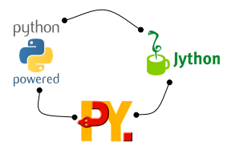

.. warning::

    execnet currently is in maintenance-only mode, mostly because it is still the backend
    of the pytest-xdist plugin. Do not use in new projects.

Python_ is a mature dynamic language whose interpreters can interact with
all major computing platforms today.

**execnet** provides a `share-nothing model`_ with `channel-send/receive`_
communication for distributing execution across many Python interpreters
across version, platform and network barriers.  It has
a minimal and fast API targetting the following uses:

* distribute tasks to (many) local or remote CPUs
* write and deploy hybrid multi-process applications
* write scripts to administer multiple environments

.. _`channel-send/receive`: http://en.wikipedia.org/wiki/Channel_(programming)
.. _`share-nothing model`: http://en.wikipedia.org/wiki/Shared_nothing_architecture

.. _Python: http://www.python.org

Features
------------------

* automatic bootstrapping: no manual remote installation.

* safe and simple serialization of python builtin
  types for sending/receiving structured data messages.
  (New in 1.1) execnet offers a new :ref:`dumps/loads <dumps/loads>`
  API which allows cross-interpreter compatible serialization
  of Python builtin types.

* flexible communication: synchronous send/receive as well as
  callback/queue mechanisms supported

* easy creation, handling and termination of multiple processes

* well tested interactions between CPython 2.5-2.7, CPython-3.3, Jython 2.5.1
  and PyPy interpreters.

* fully interoperable between Windows and Unix-ish systems.

* many tested :doc:`examples`

Known uses
-------------------

* `pytest`_ uses it for its `distributed testing`_ mechanism.

* `quora`_ uses it for `connecting CPython and PyPy`_.

* Jacob Perkins uses it for his `Distributed NTLK with execnet`_
  project to launch computation processes through ssh.  He also
  compares `disco and execnet`_ in a subsequent post.

* Ronny Pfannschmidt uses it for his `anyvc`_ VCS-abstraction project
  to bridge the Python2/Python3 version gap.

* sysadmins and developers are using it for ad-hoc custom scripting

.. _`quora`: http://quora.com
.. _`connecting CPython and PyPy`: http://www.quora.com/Quora-Infrastructure/Did-Quoras-switch-to-PyPy-result-in-increased-memory-consumption

.. _`pytest`: https://docs.pytest.org
.. _`distributed testing`: https://pypi.python.org/pypi/pytest-xdist
.. _`Distributed NTLK with execnet`: http://streamhacker.com/2009/11/29/distributed-nltk-execnet/
.. _`disco and execnet`: http://streamhacker.com/2009/12/14/execnet-disco-distributed-nltk/
.. _`anyvc`: http://bitbucket.org/RonnyPfannschmidt/anyvc/

Project status
--------------------------

The project is currently in **maintenance-only mode**, with PRs fixing bugs being gracefully accepted.

Currently there are no plans to improve the project further, being maintained mostly because it is
used as backend of the popular `pytest-xdist <https://github.com/pytest-dev/pytest-xdist>`__ plugin.

``execnet`` was conceived originally by `Holger Krekel`_ and is licensed under the MIT license
since version 1.2.

.. _`basic API`: basics.html
.. _`actively developed`: https://github.com/pytest-dev/execnet
.. _`Holger Krekel`: http://twitter.com/hpk42

.. toctree::
   :hidden:

   support
   implnotes
   install
