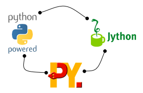

Python_ is a mature dynamic language whose interpreters can interact with
all major computing platforms today.

**execnet** provides a `share-nothing model`_ with `channel-send/receive`_
communication for distributing execution across many Python interpreters
across version, platform and network barriers.  It has
a minimal and fast API targeting the following uses:

* Distribute tasks to (many) local or remote CPUs
* Write and deploy hybrid multi-process applications
* Write scripts to administer multiple environments

.. _`channel-send/receive`: http://en.wikipedia.org/wiki/Channel_(programming)
.. _`share-nothing model`: http://en.wikipedia.org/wiki/Shared_nothing_architecture

.. _Python: http://www.python.org

Features
------------------

* Automatic bootstrapping: a worker environment that lacks execnet is
  provisioned with uv_, so there is no manual remote installation -- and no
  source of our own is ever shipped over the wire.

* Safe and simple serialization of Python builtin
  types for sending/receiving structured data messages;
  see :ref:`sending objects over a channel <serialization>`.
  Encoding rich objects is the caller's job (execnet stays
  builtin-types-only).

* Flexible communication: synchronous send/receive as well as
  callback/queue mechanisms supported

* Easy creation, handling and termination of multiple processes

* One :doc:`namespace <api>` per concurrency library you drive it from:
  threads, trio, asyncio or gevent.

* Tested against CPython 3.10+ and PyPy 3.

* Fully interoperable between Windows and Unix-ish systems.

* Many tested :doc:`examples`

.. _uv: https://docs.astral.sh/uv/

Known uses
-------------------

* `pytest`_ uses it for its `distributed testing`_ mechanism.

* `quora`_ uses it for `connecting CPython and PyPy`_.

* Jacob Perkins uses it for his `Distributed NTLK with execnet`_
  project to launch computation processes through ssh.  He also
  compares `disco and execnet`_ in a subsequent post.

* Sysadmins and developers are using it for ad-hoc custom scripting

.. _`quora`: http://quora.com
.. _`connecting CPython and PyPy`: http://www.quora.com/Quora-Infrastructure/Did-Quoras-switch-to-PyPy-result-in-increased-memory-consumption

.. _`pytest`: https://docs.pytest.org
.. _`distributed testing`: https://pypi.python.org/pypi/pytest-xdist
.. _`Distributed NTLK with execnet`: http://streamhacker.com/2009/11/29/distributed-nltk-execnet/
.. _`disco and execnet`: http://streamhacker.com/2009/12/14/execnet-disco-distributed-nltk/

Project status
--------------------------

``execnet`` is the backend of the popular `pytest-xdist
<https://github.com/pytest-dev/pytest-xdist>`__ plugin, which is both what
keeps it maintained and the compatibility bar every change is held to.
Bug reports and PRs are welcome; see :doc:`support`.

``execnet`` was conceived originally by `Holger Krekel`_ and is licensed under the MIT license
since version 1.2.

.. _`basic API`: basics.html
.. _`Holger Krekel`: http://twitter.com/hpk42

.. toctree::
   :hidden:

   support
   implnotes
   install
